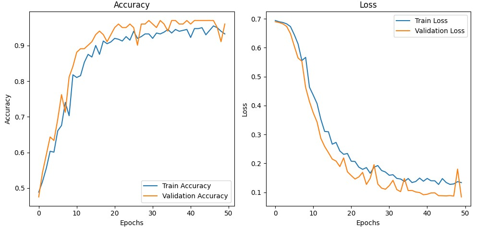
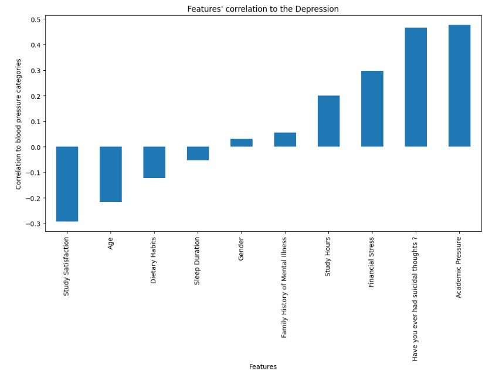
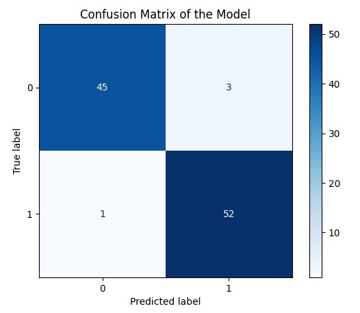

### **Short Description**  
A Python-based project for **depression detection** using a neural network. The model is trained on a student dataset containing demographic and behavioral features to predict depression status.

---

### **README.md**

# Depression Detection Model

This project builds a machine learning model using **Python** and **TensorFlow** to predict depression in students based on behavioral and demographic factors. It utilizes preprocessing techniques, exploratory data analysis (EDA), and a neural network classifier.

## Features

- **Data Preprocessing**: Categorical features are encoded for numerical analysis.
- **Exploratory Data Analysis**: Includes correlation analysis and visualizations.
- **Neural Network**: A multi-layered model implemented with TensorFlow for binary classification.
- **Evaluation Metrics**: Accuracy, precision, recall, F1 score, and confusion matrix.
- **Visualization**: Training progress, feature correlations, and confusion matrix.

## Dataset

The dataset includes the following features:

- Gender
- Age
- Academic Pressure
- Study Satisfaction
- Sleep Duration
- Dietary Habits
- Suicidal Thoughts
- Study Hours
- Financial Stress
- Family History of Mental Illness
- Depression (target variable)

### Dataset Format

The dataset is in CSV format and can be loaded using `pandas.read_csv()`.

## Requirements

- Python 3.8+
- TensorFlow
- NumPy
- Pandas
- Matplotlib
- Scikit-learn

Install dependencies using:
```bash
pip install tensorflow numpy pandas matplotlib scikit-learn
```

## Code Workflow

1. **Data Loading**: Import the dataset using pandas.
2. **Data Cleaning**: Remove duplicates and map categorical variables to numerical values.
3. **Feature Engineering**: Extract features and labels, and split data into training and testing sets.
4. **Model Building**:
   - Multi-layered neural network with ReLU and sigmoid activations.
   - Compiled with Adam optimizer and binary cross-entropy loss.
5. **Model Training**: Train for 50 epochs, validating on the test set.
6. **Evaluation**: Analyze accuracy, precision, recall, F1 score, and plot a confusion matrix.
7. **Correlation Analysis**: Visualize the correlation between features and depression.

## How to Run

1. Clone the repository:
   ```bash
   git clone https://github.com/Abdulrauf1122/Depression_Detection.git
   ```
2. Navigate to the project directory:
   ```bash
   cd Depression_Detection
   ```
3. Place the dataset file (`Depression Student Dataset.csv`) in the project folder.
4. Run the script:
   ```bash
   python main.py
   ```

## Results

- **Evaluation Metrics**:
  - Accuracy: 96%
  - Precision: 95%
  - Recall: 96%
  - F1 Score: 98%

## Visualizations

1. **Training Progress**:
   .
2. **Feature Correlations**:
   .
3. **Confusion Matrix**:
   .

## Future Enhancements

- Incorporate additional features for better prediction.
- Experiment with other machine learning models (e.g., Random Forest, SVM).
- Add support for handling missing data.

## License

This project is licensed under the [MIT License](LICENSE).
